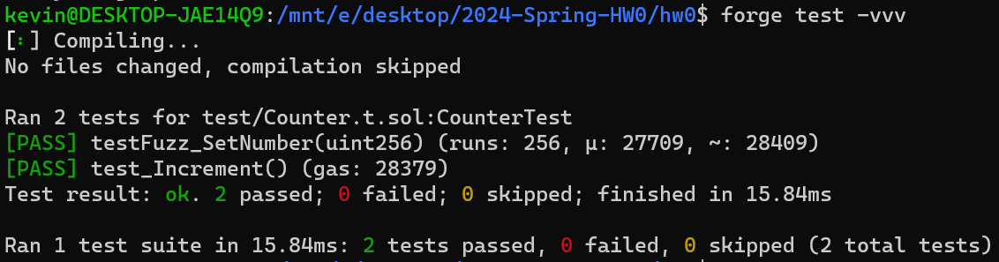
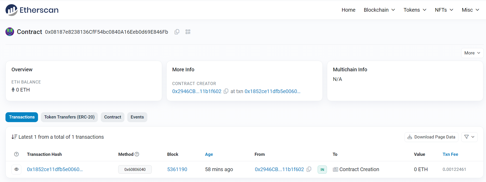

# 2024-Spring-HW0

All the detailed specified in Homework 0 documentation.

## Wallet Address
Please provide your MetaMask wallet address:0x2946CBc8fB0e622751110E99E16770D011b1f602

## Local Testing
Please provide a screenshot of the `forge test -vvv` command running in your local environment.

## Contract Address
Please provide the contract address that you deployed on the Sepolia network.
0x08187e8238136CfF54bc0840A16Eeb0d69E846Fb

## Sepolia Etherscan
Paste the contract address into the Sepolia Etherscan and share the screenshot.
